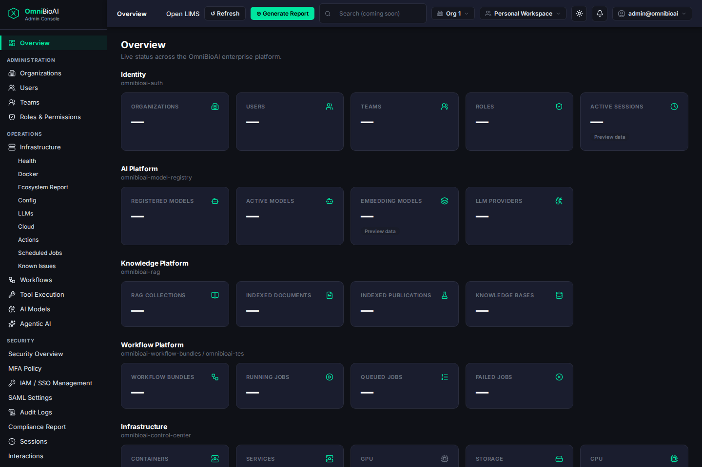
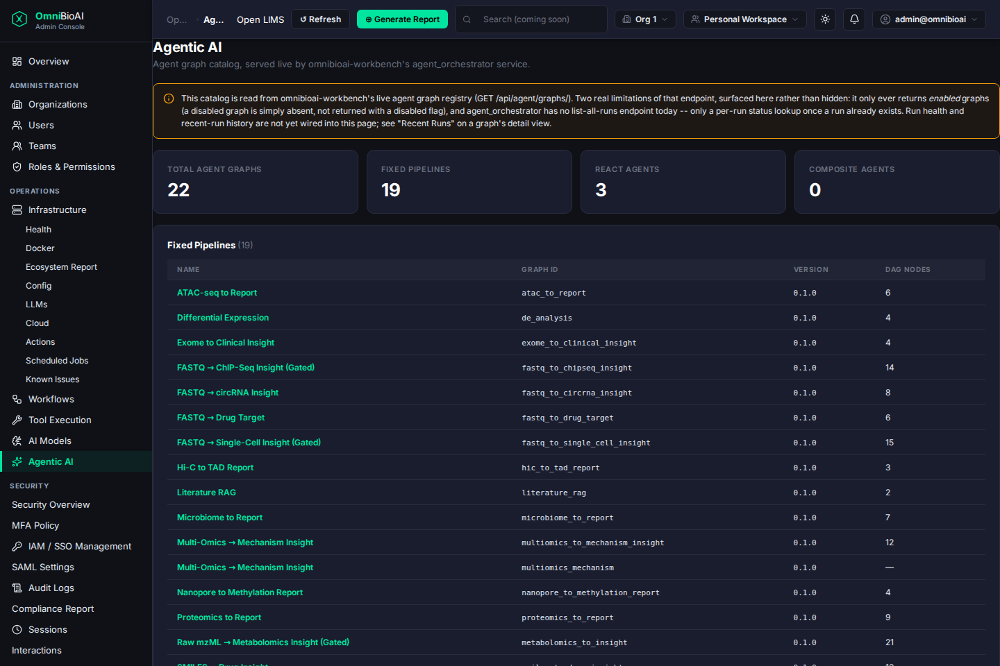
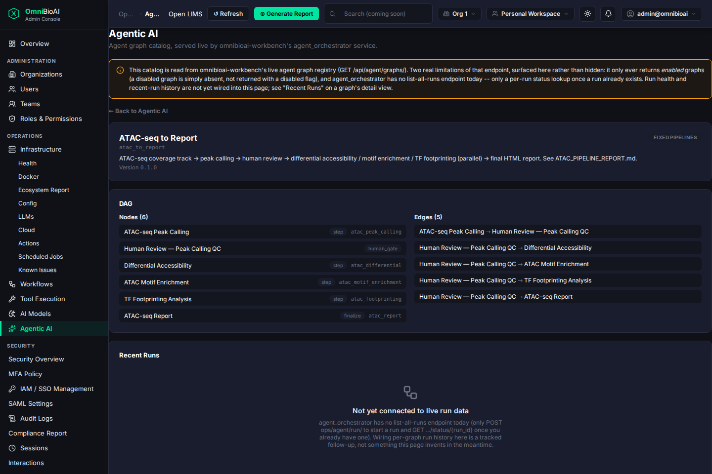

# Agentic AI Navbar — Report

Branch: `feature/agentic-ai-navbar` (off `main`, not merged — open for review).

## Step 1 — What was actually there before this PR

### Frontend structure

- **Nav items are defined in one place**: `frontend/cc-ui/src/navigation.ts`'s
  `NAVIGATION` array (`NavSection[]` → `NavItem[]`). `SidebarNav.tsx` renders
  it directly; `AdminApp.tsx`'s `renderPage()` switch is the only other
  consumer of a `PageKey`. There is no second nav-registration path — every
  recent PR (AI Models, Tool Execution, Workflows, RAG, Integrations, …)
  added its entry here and nowhere else.
- **Routing pattern**: no router library. `AdminApp.tsx` keeps `active:
  PageKey` in `useState`, `SidebarNav` calls `onNavigate(key)` on click, and
  `renderPage(active, ctx)` is a big switch. A handful of items
  (`organizations`, `iam`, `billing`, …) additionally sync a real URL via
  `window.history.pushState` for deep-linking; most flat, no-org-picker
  pages (`ai-models`, `tool-execution`, `workflows`, `rag`) don't bother.
- **Design system**: `frontend/cc-ui/src/components/ui/` (`Card`,
  `SectionHeader`, `StatCard`, `DataTable`, `EmptyState`, `LoadingState`,
  `ErrorState`, `SessionExpiredState`, `BackLink`). `StatCard` already has a
  built-in `placeholder` prop specifically for "this number isn't backed by
  a real API yet" — a strong signal this codebase already treats fabricated-
  looking data as a first-class thing to avoid, not something invented for
  this PR.
- **Existing "one real endpoint, grouped/tabbed page" precedent**:
  `AIModelsPage.tsx` and `WorkflowsPage.tsx` (both under
  `pages/operations/`) are the closest analogs — a thin `<service>.ts` data
  layer hitting a `routes_<service>_proxy.py` backend proxy, a
  loading/session/denied/error/ready state machine, real stat cards, and an
  honest "the upstream doesn't give us X yet" banner (`WorkflowsPage.tsx`'s
  `RunsNotice`) where a real limitation exists. `AgenticAIPage.tsx` below
  copies this pattern deliberately rather than inventing a new one.

### Backend structure / existing integration points

- **No existing call from control-center into omnibioai-workbench's agent
  API.** `config/control_center.yaml` registers `workbench` only as a
  health-check target (`http://workbench:8000/health/`, used for the
  ecosystem/summary status dashboard) — confirmed by grepping the whole repo
  for "workbench": every other hit is either that health check, a shared
  MySQL/Redis instance comment, or an unrelated `localStorage` key-naming
  convention borrowed for `auth.ts`. There was no `routes_*_proxy.py` file,
  no frontend data-layer file, and no nav item touching workbench's agent
  orchestrator before this PR.
- **Existing service-to-service proxy pattern** (used by `tes.ts`/
  `routes_tes_proxy.py`, `model_registry.ts`/`routes_model_registry_proxy.py`,
  `rag.ts`/`routes_rag_proxy.py`, `workflows.ts`/
  `routes_workflow_bundles_proxy.py`): a `router = APIRouter()` per service,
  one `_proxy(path, request)` helper using `httpx.AsyncClient`, forwarding
  the caller's `Authorization` header verbatim (never deciding
  authorization itself), returning the upstream status code and body as-is,
  and a `<SERVICE>_URL = os.environ.get(...)` pointing at the docker-compose
  service name. Wired into `main.py` via `app.include_router(...)` with **no**
  blanket permission dependency for the three services above — each
  upstream's own auth posture (or lack of one) is the real gate; the nav
  item's `visible: hasAdminAccess` in `navigation.ts` only decides whether
  the *link* renders. New Agentic AI code follows this exact convention
  (`routes_agent_orchestrator_proxy.py`).
- Also required and easy to miss (confirmed from three prior PRs' own
  comments, which flagged this as a real, previously-shipped gap): a new
  proxy prefix needs a matching entry in **both**
  `frontend/cc-ui/vite.config.ts`'s dev proxy list (or `npm run dev` 404s)
  **and** `docker/nginx/api-proxy.conf` (or production 404s the same way,
  silently falling through to the SPA's `index.html`). Both were added
  alongside the new route in this PR.

### Reading omnibioai-workbench's real endpoints

- `omnibioai/services/agent_orchestrator/urls.py` confirms the two
  endpoints named in the task are real: `GET /api/agent/graphs/`
  (`views.api_graphs`) and `POST /ops/agent/run/` (`run_views.api_run`,
  async, HITL-capable, plus `.../status/{run_id}`,
  `.../approve/{run_id}`, `.../artifacts/{run_id}`, `.../log/{run_id}`).
- `api_graphs` calls `graphs/registry.py::list_graphs(include_disabled=False)`
  — **no query parameter exists to ask for disabled graphs too**; a graph
  with `"enabled": false` in `definitions.json` is simply absent from the
  response, never returned with a disabled flag. The projected dict shape
  is `{graph_id, display_name, description, version, enabled, inputs_schema,
  dag}` — no `builder`/architecture-kind field survives into the API
  response, even though `registry.py` resolves one internally.
- There is **no list-all-runs endpoint anywhere in agent_orchestrator** —
  only `POST ops/agent/run/` to start one and `GET .../status/{run_id}`
  once you already have a `run_id`. This directly shaped Step 3/4 below.
- `router.route()` (the actual agent-execution entrypoint, used by the
  `POST` routes) is gated behind a feature flag
  (`OMNIBIOAI_ENABLE_AGENTIC_AI`, off by default) — but **`api_graphs` does
  not check this flag at all**. The read-only catalog this PR builds works
  regardless of whether agent execution is globally enabled on a given
  deployment; this page cannot tell you whether that flag is on, and
  doesn't claim to.

### A real discrepancy this PR found by testing, not just reading

Reading `views.py` directly, `api_graphs` has no `@login_required`/`Depends`
of any kind — the initial conclusion (and the assumption `agent_orchestrator.ts`'s
first draft shipped with) was "unauthenticated upstream, like model-registry's
three GET routes." **Live-testing against this machine's actual running
omnibioai-studio docker stack disproved that**: `GET /api/agent/graphs/`
returned a real `401 {"error": "Authentication required", "code":
"UNAUTHORIZED"}` with no token.

The cause is `plugins/multi_agent_bio_orchestrator/middleware.py`'s
`AuthenticationMiddleware`, registered globally in `omnibioai/settings.py`'s
`MIDDLEWARE` list. Its own code comment (citing issue #225) says it guards
"only THIS plugin's own traffic" via a path check —
`path.startswith('/api/') or path.startswith(self.PLUGIN_MOUNT)` — but that
guard matches **every** `/api/*` route project-wide, including
`agent_orchestrator`'s, not just this plugin's own mount. So the real,
live behavior is: every `/api/agent/...` call needs a valid session or an
`omnibioai-auth`-issued Bearer JWT, even though `views.py` alone would
suggest otherwise. `routes_agent_orchestrator_proxy.py` was already written
to forward the `Authorization` header unconditionally (matching the
established proxy convention), so no code change was needed once this was
found — only the module comments (initially claiming "no auth requirement
upstream") were corrected to describe what's actually true. Worth flagging
back to omnibioai-workbench as a surprising cross-plugin side effect, not
something this PR attempts to fix.

## Step 2 — Navbar item

Added to `navigation.ts`'s `operations` section, right after `ai-models`
(same section as Tool Execution/AI Models/Workflows/RAG — the other
"external service catalog, no org picker" pages):

```ts
{ key: 'agentic-ai', label: 'Agentic AI', functional: true, visible: hasAdminAccess },
```

Same `hasAdminAccess` gate every sibling item in that section already uses,
for the same reason documented in-line: it's the only real access control
this nav *entry* has (the actual boundary is now workbench's own
`AuthenticationMiddleware`, described above — the `Authorization` header is
forwarded through unchanged, so a logged-in admin's own session
transparently authenticates against workbench too). `SidebarNav.tsx` got a
`Sparkles` icon mapping; `AdminApp.tsx` got the render-switch case (no org
picker, matching `ai-models`/`tool-execution`).

## Step 3 & 4 — What was built

Step 1 found a real, reachable integration point (`GET
/api/agent/graphs/`, on the same `workbench` host control-center already
health-checks), so this is the "wire it for real" branch, not the
"honest empty shell" one — with two upstream limitations disclosed rather
than papered over:

- **`routes_agent_orchestrator_proxy.py`** (new): one route,
  `GET /agent-orchestrator/graphs` → `GET /api/agent/graphs/`, same
  `httpx`-relay pattern as `routes_tes_proxy.py`/`routes_model_registry_proxy.py`.
  No blanket permission dependency in `main.py` (same posture as those two)
  — the `Authorization` header is forwarded, and workbench's own middleware
  is the real gate now that it's understood.
- **`agent_orchestrator.ts`** (new): `fetchAgentGraphs()` unwraps
  workbench's `{"graphs": [...]}` envelope into a flat array; every field
  on `AgentGraph` is copied straight from that response. `classifyArchitecture()`
  is the one non-upstream thing this file adds — a disclosed, comment-heavy
  heuristic (display_name contains `"(ReAct)"` → ReAct agent, contains
  `"composite"` → composite, else fixed pipeline) used only for display
  grouping, since the real API drops the `builder` field before responding.
- **`AgenticAIPage.tsx`** (new): `SectionHeader` → an amber info banner
  (same visual convention as `WorkflowsPage.tsx`'s `RunsNotice`) stating the
  two real endpoint limitations plainly → real stat cards (Total / Fixed
  Pipelines / ReAct Agents / Composite Agents, all live counts) → three
  grouped `DataTable`s → click a graph's name to drill in: real
  description/version, real DAG (nodes + edges, straight from the
  response), and a **Recent Runs** section that is an explicit
  `EmptyState` — "Not yet connected to live run data" — never a plausible-
  looking fake row, because no real data exists to show there yet.
- Nothing here reads or duplicates `definitions.json` directly (that file
  lives inside the workbench container, not something control-center has
  filesystem access to) — every field comes from the one HTTP response.

### What's still not wired (by design, not oversight)

- **Disabled graphs**: invisible to this page, because they're invisible to
  the endpoint (`include_disabled=False` is hardcoded upstream, no query
  param exists to change it). Every graph shown is `enabled: true` — stated
  once in the banner rather than rendered as a per-row toggle that would
  imply a "disabled" state this page could ever actually observe.
- **Run history / health**: no upstream endpoint exists to back it (only a
  single-run status lookup once a `run_id` is already known). Explicit
  empty state on every drill-in, not a partial/best-effort fake.

## Verification

- **Automated**: `npx vitest run` — 606 tests passed (incl. 13 new:
  `agent_orchestrator.test.ts`, `AgenticAIPage.test.tsx`), `npx tsc -b`
  clean, `npm run build:admin` succeeds. Backend: `pytest -q --no-cov` —
  1407 passed (incl. 6 new in `test_routes_agent_orchestrator_proxy.py`).
  `ruff check` clean on every new/edited file.
- **Manual, end-to-end, against real running services** (this machine
  already had the full `omnibioai-studio` docker-compose stack up —
  `workbench`, `auth-service`, and the *pre-this-PR* `control-center`
  container were all live): rather than rebuild/restart those shared
  containers, this PR's own updated backend and frontend were run as
  disposable, separate local processes (alternate ports, pointed at the
  real `workbench`/`auth-service` containers via `WORKBENCH_URL`/`IAM_URL`/
  `JWT_SECRET` overrides) purely to screenshot against real data without
  touching anyone else's running stack. Both processes and the one
  temporary `vite.config.ts` port edit used to reach them were torn down/
  reverted afterward — `git status` shows only the intended file changes.
  - Logged in as the real local bootstrap admin account (`ADMIN_EMAIL`/
    `ADMIN_BOOTSTRAP_PASSWORD`, already provisioned in this dev
    environment's own `.env` for exactly this kind of local verification)
    through the actual `LoginScreen` → `/auth/login` → `/auth/validate`
    flow — a real JWT, not a mocked session.
  - Confirmed **22 real agent graphs** returned live from the running
    `omnibioai-workbench` container (a different count than the 39 in this
    checkout's own `definitions.json` — that live container is running an
    older image, which is itself the expected, honest behavior: this page
    always reflects whatever's actually deployed, not this repo's working
    tree).
  - Screenshots (`docs/images/agentic-ai-navbar/`):

    | | |
    |---|---|
    |  | **Agentic AI** in the Operations section of the sidebar, real admin session (`admin@omnibioai`, top right). |
    |  | Real catalog: 22 total / 19 fixed pipelines / 3 ReAct agents / 0 composite (this deployment has no composite-agent graphs registered) — every row a real `graph_id`/version/DAG-node-count. |
    |  | Drill-in on "ATAC-seq to Report": real 6-node/5-edge DAG, and the honest "Not yet connected to live run data" state under Recent Runs. |

## Files changed

- `frontend/cc-ui/src/navigation.ts`, `src/components/shell/SidebarNav.tsx`,
  `src/apps/AdminApp.tsx` — nav wiring (Step 2).
- `frontend/cc-ui/src/agent_orchestrator.ts`,
  `src/pages/operations/AgenticAIPage.tsx` (+ `.test.ts(x)` for both) — new
  data layer + page (Step 3/4).
- `backend/src/control_center/api/routes_agent_orchestrator_proxy.py` (+
  test) and `backend/src/control_center/main.py` — new proxy route.
- `frontend/cc-ui/vite.config.ts`, `docker/nginx/api-proxy.conf` — dev/prod
  proxy entries for the new `/agent-orchestrator` prefix.
- `docs/images/agentic-ai-navbar/*.png` — the screenshots above.

Not merged to `main`. Opened as a PR from `feature/agentic-ai-navbar` for
review.
