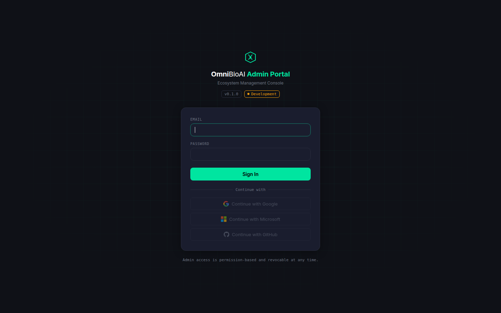
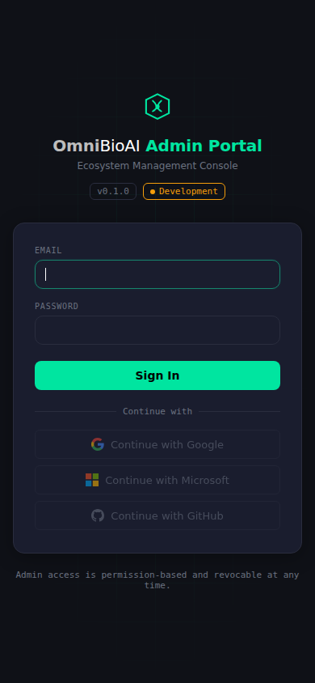
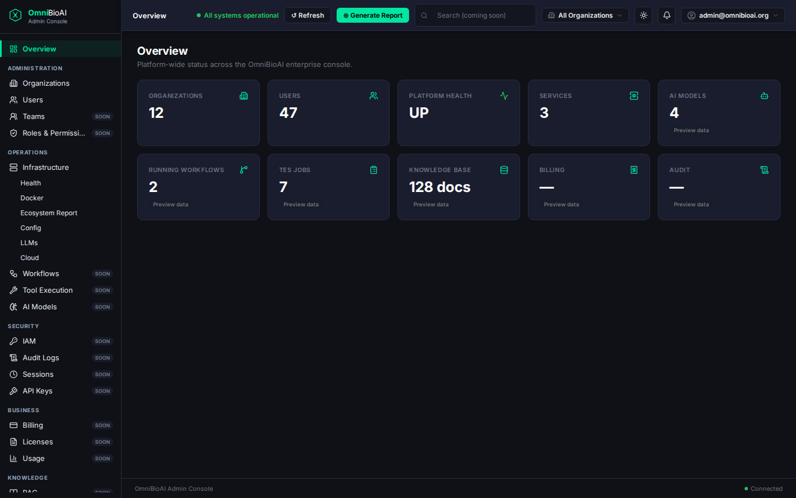
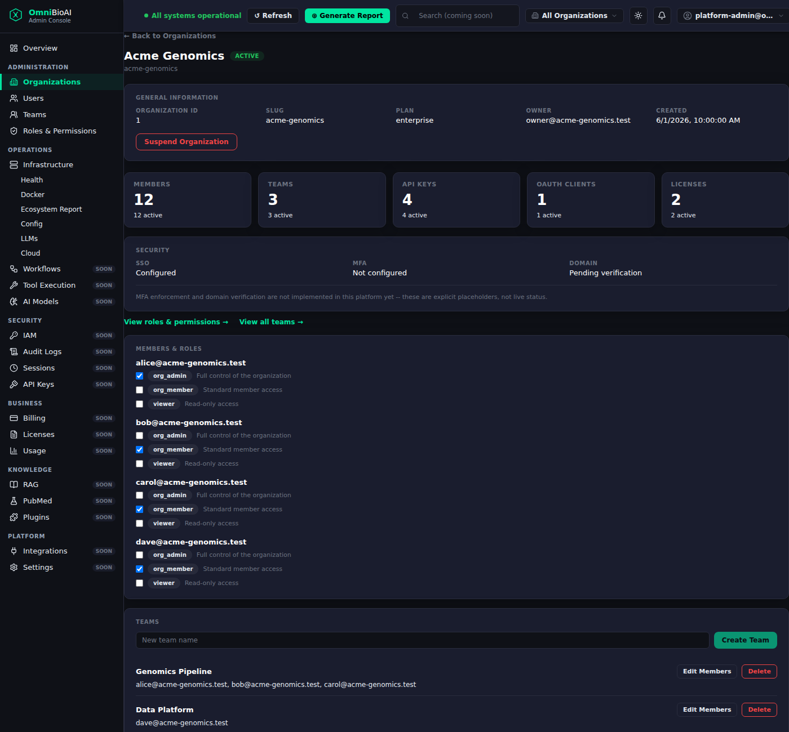
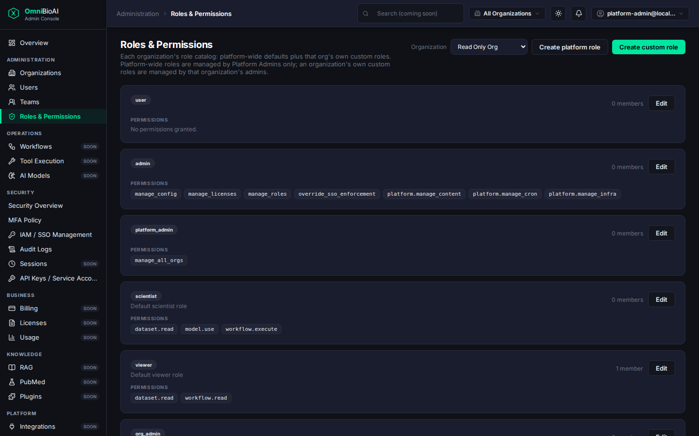

# OmniBioAI Admin Console

The Admin Console is the primary administrative and operational interface for
the OmniBioAI platform. It gives authorized users one place to manage
organizations and identity, inspect platform health, review security and
compliance data, monitor usage, and access the platform's workflow, tool,
model, and knowledge capabilities.

This document is the maintained guide to the Admin Console. Phase and pull
request documents in `docs/` explain individual design decisions and rollout
history; they are supporting references, not a replacement for this guide.

## At a glance

| Item | Current state |
|---|---|
| Frontend | React + TypeScript + Vite in `frontend/cc-ui` |
| Backend | FastAPI in `backend/src/control_center` |
| Admin build | `VITE_APP_MODE=admin`, output `dist-admin/` |
| Control build | `VITE_APP_MODE=control`, output `dist-control/` |
| Admin hostname | `admin.omnibioai.org` (deployment cutover still requires external DNS, tunnel, and Access configuration) |
| Operations hostname | `control.omnibioai.org` |
| Local frontend | Vite development server, normally `http://localhost:5173` |
| Local backend | Control Center API, normally `http://localhost:7070` |
| Navigation source of truth | `frontend/cc-ui/src/navigation.ts` |
| Authentication | OmniBioAI Auth access token plus server-set HttpOnly refresh cookie |
| Data ownership | Domain services own the data; Control Center provides browser-facing proxy routes |

## What the console does

The Admin Console combines the following capabilities:

- organization and membership administration;
- users, teams, roles, permissions, API keys, and service accounts;
- SSO, SAML, organization MFA policy, sessions, and security activity;
- audit logs, interaction history, HIPAA compliance reporting, and platform
  compliance history;
- infrastructure health, Docker, ecosystem status, configuration, LLMs,
  cloud, actions, scheduled jobs, and known issues;
- billing, invoices, subscriptions, usage limits, and usage analytics;
- workflows, tool execution, and AI model registry status;
- RAG/PubMed status and indexed-study information;
- integration status and platform settings.

Pages describe data as unavailable, denied, or degraded when the owning
service cannot provide it. The UI does not manufacture live-looking values for
an unavailable service.

## UI snapshots

The following login captures were taken from the current Admin build on
2026-08-24. They are the current unauthenticated entry point; live dashboard
captures require the backend services and an authenticated test account.

### Current login screen





The remaining captures below illustrate authenticated workflows using
repository fixture data. They are visual references, not a source of truth for
current navigation or feature status. For current behavior, use the
implementation and tests referenced below.

### Overview and navigation



The overview shows the persistent navigation, organization context, session
controls, platform status, and summary cards.

### Organization details



Organization details combine membership, teams, service-account summaries,
security configuration, and links to deeper administration pages.

### Roles and permissions



Platform administrators can inspect role catalogs and permission grants while
organization administrators work within their authorized organization scope.

## Admin Console and Control Console

The repository produces two frontend bundles from the same source tree:

```text
VITE_APP_MODE=admin   -> AdminApp   -> dist-admin/  -> admin.omnibioai.org
VITE_APP_MODE=control -> ControlApp -> dist-control/ -> control.omnibioai.org
```

The Admin build contains the enterprise console and the operations pages. The
Control build contains the operations console only. `src/main.tsx` selects the
root application at build time, allowing Vite/Rollup to remove the unused
application branch from the production bundle.

Both builds share:

- the authentication state machine in `src/apps/AuthGate.tsx`;
- the authentication and session helpers in `src/auth.ts`;
- common API and formatting utilities;
- the same FastAPI backend and upstream services;
- the same server-side authorization rules.

The build or hostname is not a security boundary. A request is authorized by
the backend and, for proxied resources, by the service that owns the resource.
Never add authorization logic that trusts the `Host` header or assumes that a
request came from the operations hostname.

## Navigation and feature catalog

Navigation is defined once in `frontend/cc-ui/src/navigation.ts`. The sidebar,
breadcrumbs, page lookup, and AdminApp routing derive from that structure.
Visibility helpers are UX hints that prevent unusable links from being shown;
the backend repeats the authorization check for every protected request.

### Overview

The Overview page aggregates organization, user, security, billing, workflow,
model, RAG, and platform information through `/dashboard/summary`. Cards that
cannot be populated from a live service are labeled accordingly.

### Administration

| Page | Purpose | Typical access signal |
|---|---|---|
| Organizations | Browse organizations and open organization details | Organization membership, platform administration, or `admin` role |
| Users | Browse platform users and inspect user details | `manage_all_orgs` |
| Teams | Manage organization teams and membership | Organization access |
| Roles & Permissions | Inspect and manage organization custom roles and permissions | Organization access; mutations are checked server-side |

Organization-scoped pages commonly begin with an organization picker. The
selected organization is context for the request; it does not override the
service's membership or permission checks.

### Operations

The Infrastructure group contains the original Control Center operations
surface:

- Health
- Docker and plugin image status
- Ecosystem Report
- Config
- LLMs
- Cloud
- Actions
- Scheduled Jobs
- Known Issues

The same section also provides:

- **Workflows** — reads workflow definitions, categories, and runs from the
  workflow-bundles service;
- **Tool Execution** — shows available tools and organization-scoped runs
  from TES;
- **AI Models** — shows registered models, versions, health, and runtime auth
  status from model-registry.

Writes for Control Center operations are protected by the relevant backend
permissions, such as infrastructure, content, or cron-management permissions.

### Security

- **Security Overview** — cross-organization MFA and security summaries;
- **MFA Policy** — organization MFA requirements and overrides;
- **IAM / SSO Management** — organization SSO configuration and enforcement;
- **SAML Settings** — organization SAML configuration;
- **Audit Logs** — platform identity and security audit events;
- **Compliance Report** — the platform-admin HIPAA basic compliance report;
- **Sessions** — the signed-in user's own sessions;
- **Interactions** — platform interaction records;
- **API Keys / Service Accounts** — organization API keys and OAuth clients.

Secrets are not displayed after creation unless the owning service explicitly
supports that behavior. API key and client-secret creation follows the
one-time-secret pattern: the value is returned for the creation response and
must not be logged or persisted by the Admin Console.

### Compliance

**HIPAA Compliance** is separate from Security > Compliance Report. It records
the platform's engineering remediation and control-change history. It is not an
organization's compliance-data export and should not be described as one.

### Business

- **Billing** — organization subscription, invoices, usage, usage limits, and
  cost information exposed by the billing service;
- **Usage Analytics** — organization/team-scoped usage and interaction
  analytics. Platform administrators may filter across organizations; other
  users are scoped by the backend to their organization or team.

### Knowledge

- **RAG** — RAG service health, cache statistics, and indexed studies;
- **PubMed** — the current indexed corpus view. Both navigation entries point
  to the same page because PubMed abstracts are the RAG service's current
  indexed corpus, not a separate backend product.

### Platform

- **Integrations** — status for the integrations currently represented by
  Control Center configuration, including Sentry and Discord webhook targets;
- **Settings** — read-only view of platform configuration from Auth.

The platform configuration write endpoint is deliberately not exposed by the
Admin Console yet because it can change platform-wide LLM and cloud
credentials. Adding that mutation requires a separate security review.

## Authentication and authorization

### Browser session model

The login flow uses the OmniBioAI Auth service through Control Center's
`/auth/*` proxy routes:

1. The user submits credentials or an enabled SSO option.
2. Auth returns a short-lived access token and sets a refresh token in the
   server-managed `omnibioai_session` HttpOnly cookie.
3. The access token is used for API calls and is stored under the existing
   ecosystem-compatible local-storage key.
4. The client decodes the access-token expiry and refreshes shortly before it
   expires.
5. A failed refresh or an API `401` clears the client session and returns the
   user to the login screen.
6. Logout calls the Auth logout flow, clears the access token, and revokes the
   refresh session server-side.

The refresh token is never JavaScript-readable and must not be moved into
local storage. Do not add token values to logs, error messages, screenshots, or
API responses.

### UI access signals

The frontend currently derives navigation visibility from the validated
session:

| Helper | Meaning |
|---|---|
| `hasAdminAccess()` | The user has the global `admin` role; used for operations and platform-wide pages |
| `hasPlatformAdminAccess()` | The session includes `manage_all_orgs` |
| `hasOrganizationsAccess()` | Global admin, platform admin, or a valid organization context |
| `canSeeAnalytics()` | Platform admin, organization admin, or team admin |
| `hasPermission(name)` | The validated session contains a named permission |

These functions only control rendering and navigation. They are not substitutes
for backend authorization. A user can receive a `403` even when the UI showed a
button because the selected organization, role, or current server policy did
not authorize that specific operation.

### Server-side enforcement

Authorization is enforced in layers:

- Control Center protects its own operations routes with dependencies such as
  `require_admin` and `require_permission`;
- proxy routes forward the caller's `Authorization` header to the owning
  service;
- Auth, billing, TES, workflow-bundles, and other owning services make the
  authoritative organization and permission decision;
- nginx may perform an outer authentication check in deployment, but an nginx
  configuration error must never be able to expose a protected write route.

The Admin Console must not accept organization IDs, roles, or permissions from
the browser as proof of access. Those values are request context only.

## Backend and data ownership

Control Center is an orchestration and presentation layer. It does not own the
main organization, user, role, billing, workflow, model, or RAG datasets.
Thin FastAPI routers provide stable browser-facing paths and relay requests to
the service that owns the data.

| Control Center route family | Owning service | Router |
|---|---|---|
| `/auth/*`, `/orgs/*`, `/platform/users`, `/platform/roles`, `/organizations/*` | Auth/IAM | `routes_auth_proxy.py`, `routes_org_proxy.py`, `routes_user_proxy.py`, `routes_role_proxy.py` |
| `/orgs/*/teams` | Auth/IAM | `routes_team_proxy.py` |
| `/orgs/*/api-keys`, `/orgs/*/oauth-clients` | Auth/IAM | `routes_service_accounts_proxy.py` |
| `/orgs/*/sso`, `/orgs/*/saml`, `/orgs/*/mfa-policy` | Auth/IAM | `routes_org_sso_proxy.py`, `routes_org_saml_proxy.py`, `routes_org_mfa_proxy.py` |
| `/platform/audit-events`, `/platform/interactions`, `/sessions` | Auth/IAM | `routes_audit_proxy.py`, `routes_platform_interactions_proxy.py`, `routes_sessions_proxy.py` |
| `/billing/*` | Billing | `routes_billing_proxy.py` |
| `/tes/*` | TES | `routes_tes_proxy.py` |
| `/workflow-bundles/*` | Workflow Bundles | `routes_workflow_bundles_proxy.py` |
| `/model-registry/*` | Model Registry | `routes_model_registry_proxy.py` |
| `/rag/*` | RAG | `routes_rag_proxy.py` |
| `/auth/config` | Auth/IAM | `routes_platform_config_proxy.py` |
| `/hipaa-compliance/*` | Control Center | `routes_hipaa_compliance.py` |
| `/dashboard/*`, `/analytics/*` | Control Center aggregation | `routes_dashboard.py`, analytics package |

Proxy routes use a consistent pattern: forward authorization, apply a bounded
request timeout, map upstream failures to a useful response, and avoid
returning or logging server-side secrets. When adding a proxy, preserve this
pattern and add both development and production routing.

## Local development

### Start the backend

From the repository root, install the backend in editable mode with its
development dependencies:

```bash
cd backend
pip install -e ".[dev]"
pytest tests/ -v
```

Start the Control Center API using the repository's normal environment and
configuration. The default local API address used by the frontend is:

```text
http://localhost:7070
```

The exact service environment depends on the surrounding OmniBioAI ecosystem;
the proxy defaults are visible in the individual `routes_*_proxy.py` modules.

### Start the frontend

```bash
cd frontend/cc-ui
npm install
npm run dev
```

Vite proxies Admin Console API paths to `http://localhost:7070`. The proxy
configuration is in `frontend/cc-ui/vite.config.ts`. Important paths include
`/auth`, `/orgs`, `/platform`, `/organizations`, `/billing`, `/sessions`,
`/tes`, `/model-registry`, `/workflow-bundles`, `/rag`, and
`/hipaa-compliance`.

Use a production-like Admin bundle locally when needed:

```bash
npm run build:admin
npm run preview -- --host 0.0.0.0
```

### Build commands

| Command | Result |
|---|---|
| `npm run build` | Legacy/default `dist/` build |
| `npm run build:admin` | Admin Console bundle in `dist-admin/` |
| `npm run build:control` | Operations-only bundle in `dist-control/` |
| `npm test` | Frontend Vitest suite |
| `npx tsc --noEmit -p tsconfig.app.json` | Frontend type check |

The generated `dist-admin/` and `dist-control/` directories are ignored by
Git and should be rebuilt rather than committed.

## Deployment architecture

The production web image builds all required frontend artifacts and nginx
serves them by hostname:

```text
admin.omnibioai.org  ─┐
                      ├─ Cloudflare Tunnel ─ control-center-web :5174
control.omnibioai.org ┘                         │
                                                ├─ dist-admin or dist-control
                                                └─ /api paths → Control Center :7070
```

The serving image is defined by the repository Dockerfile and
`docker/nginx/control-center.conf`. FastAPI does not serve the frontend
static files directly. The nginx image contains both bundles:

```text
/usr/share/nginx/html/admin  <- dist-admin
/usr/share/nginx/html/control <- dist-control
```

The current repository status is:

- the dual-build image and host-based nginx serving are implemented and
  locally verifiable on port `5174`;
- the external `admin.omnibioai.org` DNS record and tunnel ingress must be
  applied on the tunnel host;
- Cloudflare Access policy coverage for the new Admin hostname must be
  verified separately;
- the Admin hostname must not be considered production-reachable until those
  external prerequisites are complete.

See [`admin-console-build.md`](../admin-console-build.md) for the detailed
deployment decision and rollout diagram.

## Configuration and service dependencies

The backend uses service URL environment variables. Defaults are intended for
the repository's container network and can be overridden in deployment:

| Variable | Default | Used for |
|---|---|---|
| `IAM_URL` | `http://auth-service:8001` | Auth, organizations, users, roles, teams, SSO, SAML, MFA, sessions, audit |
| `BILLING_URL` | `http://billing-service:8005` | Billing and usage |
| `TES_URL` | `http://tes:8081` | Tool execution |
| `MODEL_REGISTRY_URL` | `http://model-registry:8095` | AI models |
| `WORKFLOW_BUNDLES_URL` | `http://workflow-bundles:8098` | Workflows |
| `RAG_URL` | `http://rag:8096` | RAG and PubMed |
| `RAGBIO_API_KEY` | deployment-specific | Service credential for RAG requests |
| `JWT_SECRET` / auth secret | deployment-specific | Local verification and analytics event integrity |

Secrets belong in the deployment secret manager or environment, never in the
frontend bundle, source tree, screenshots, or README examples.

## Testing and verification

Frontend changes should normally include:

```bash
cd frontend/cc-ui
npx tsc --noEmit -p tsconfig.app.json
npm test
npm run build:admin
npm run build:control
```

Relevant tests cover authentication, navigation, AdminApp routing, page
loading/error/empty states, organization and identity components, billing,
security, compliance, analytics, and the individual capability pages.

Backend changes should include the applicable focused pytest tests and the
full backend suite before handoff:

```bash
cd backend
pytest tests/ -v
```

For build-split changes, verify that the control bundle does not contain
enterprise-only page code and that the Admin bundle does. The build split is
intended to remove code from the bundle, not merely hide links at runtime.

## Troubleshooting

### The page loads but data requests return 404

Check both routing layers:

1. For local development, confirm the path exists in
   `frontend/cc-ui/vite.config.ts`.
2. For a production image, confirm the path exists in
   `docker/nginx/api-proxy.conf`.
3. Confirm the corresponding FastAPI router is included in
   `backend/src/control_center/main.py`.

### The page returns 401

The access token may be expired or the refresh cookie may be absent. Sign out
and sign in again, then check that the browser is sending credentials to the
same Auth origin. Do not work around this by copying a refresh token into
local storage.

### The page returns 403

The backend is authoritative. Confirm the user's role, permission, selected
organization, and organization membership in the owning service. A frontend
visibility helper can be stale or intentionally approximate; it must never be
changed to bypass a backend denial.

### A page shows an upstream unavailable state

Check the owning service URL, container health, credentials, and network path
from the Control Center container. Proxy routes intentionally map connection
failures to a service-unavailable response so one unavailable dependency does
not break the entire Admin Console.

### The Admin hostname shows the wrong application

Check the request's `Host` header, nginx `server_name` blocks, the bundle copied
into the web image, and the Cloudflare Tunnel ingress rule. The frontend build
mode and hostname routing are deployment concerns; they do not change backend
authorization.

## Adding a new Admin Console page

Use this sequence for a new capability:

1. Identify the service that owns the data and its authoritative permissions.
2. Decide whether Control Center needs an aggregation route or a thin proxy.
3. Add or update the backend router and include it in `main.py`.
4. Add the matching Vite development proxy and nginx production route.
5. Implement the page using shared shell and UI primitives.
6. Add the page to `navigation.ts` with the existing UX visibility helper;
   do not invent a frontend-only permission model.
7. Cover loading, empty, `401`, `403`, `404`, `5xx`, and retry states.
8. Add focused tests and rebuild both Admin and Control bundles.
9. Update this README's feature catalog, service table, and status notes.

If the upstream capability does not exist, leave the feature out until there
is an explicit product and backend decision. Do not create a page that implies
data or mutations the owning service cannot support.

## Current boundaries and follow-up work

- Settings is read-only; platform-wide credential mutation is not exposed.
- The Admin build is implemented, but external hostname cutover still needs
  DNS, tunnel, and Access work.
- The Control build is an operations surface, not an alternate authorization
  model.
- Organization and platform permissions remain enforced by backend services.
- The Admin Console should not grow a second copy of organization, billing,
  audit, or identity data.
- Older phase documents may describe features as Coming Soon or not yet
  implemented. Confirm current behavior against `navigation.ts`, page source,
  and tests before relying on those historical notes.

## Reference documents

- [`docs/admin-console-build.md`](../admin-console-build.md) — dual-build and
  deployment architecture;
- [`docs/admin-console-phase2-findings.md`](../admin-console-phase2-findings.md)
  — shell and navigation architecture history;
- [`docs/pr-e-admin-console-production-hardening.md`](../pr-e-admin-console-production-hardening.md)
  — proxy, frontend state, and production hardening audit;
- [`docs/pr-e2-enterprise-ux-hardening.md`](../pr-e2-enterprise-ux-hardening.md)
  — shared UX, accessibility, responsive, and error-state hardening;
- [`frontend/cc-ui/src/navigation.ts`](../../frontend/cc-ui/src/navigation.ts)
  — implemented navigation source of truth;
- [`frontend/cc-ui/src/auth.ts`](../../frontend/cc-ui/src/auth.ts)
  — client session model and UX access helpers.

Last reviewed: 2026-08-24.
